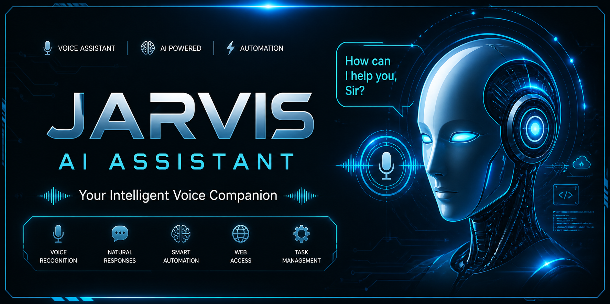

# 🤖 Jarvis AI Assistant



> A smart AI voice assistant capable of understanding commands, automating tasks, and interacting with users using speech recognition.

---

---

## 🚀 Features

* 🎤 Voice recognition
* 🔊 Text-to-speech responses
* 🌐 Open websites & apps
* 📅 Tell time, date, weather
* 🤖 Smart command execution

---

## ⚙️ Tech Stack

* 🐍 Python / Java
* 🎙️ SpeechRecognition
* 🔊 pyttsx3 / TTS
* 🤖 AI logic

---


---

## 🚀 Getting Started

### Install dependencies

```bash
pip install -r requirements.txt
```

### Run project

```bash
python main.py
```

---

## 📂 Project Structure

```bash
src/
 ├── main.py
 ├── voice.py
 ├── commands.py
```

---

## 📌 Author

SHRIYASH ZOMAN
